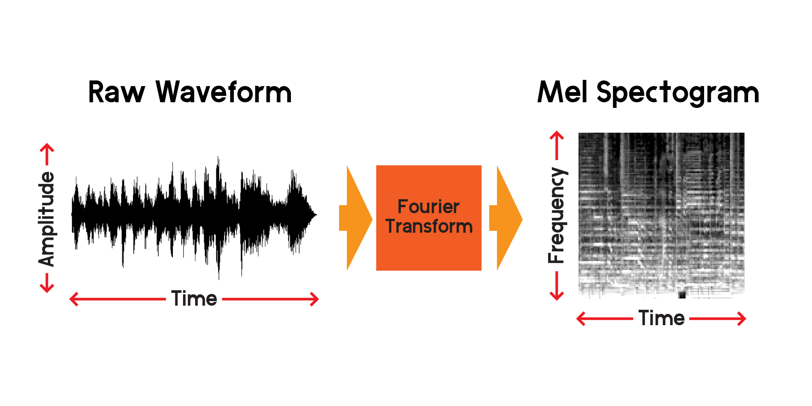
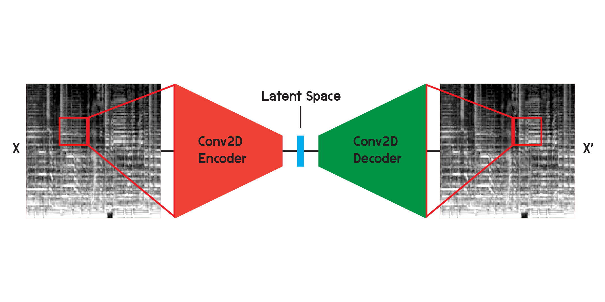
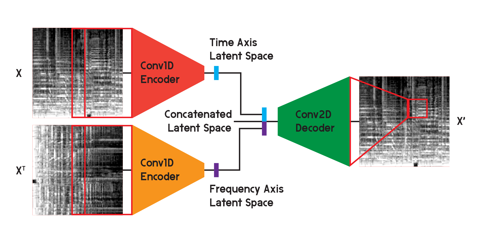
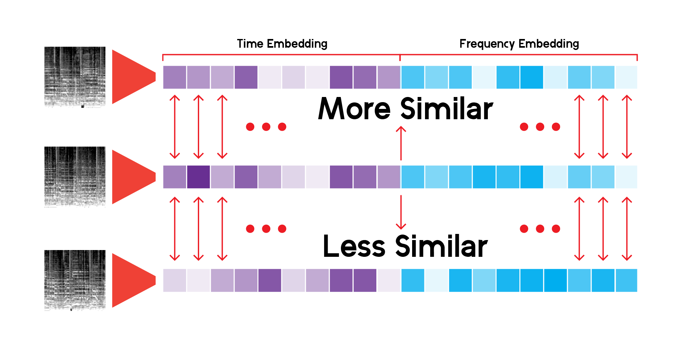

# Exploring the Sonic Landscape

## A Music Recommendation System Based on Sound Content

If you're like me, you love music. I love music and I love to find new music. Spotify is one of the top streaming services for music on the internet, and it already includes amazing tools that help you to discover new music based on what you listen to. It does this through a combination of different algorithms, including collaborative filtering where similar usage between users is tracked and used to generate recommendations or content-based recommendations which recommend new songs based on similar information between the information linked to a song. Like a song? On Spotify, you can listen to that song's 'radio', which will collect a group of songs similar to that song in some way or a combination of ways. What if you like a song, but don't care about any information other than just the sound in it? Sometimes, that is all I want to hear.

I created this project to make a music recommendation system based on the information in the sound of music alone. It will help a user to find new music through similar sounding songs. To do that, it will also explore the similarities between all music, and attempt to capture the timbre, rhythm, and style of a song mathematically.

### What is sound?

Sound is always around us. Throughout our lives, we grow to discern different sounds from others. Music is no different - there are many types of music and music is often a combination of many different kinds of sounds and rhythms that we can also discern apart from others. But can we quantify that information for ourselves? Sometimes, music is categorized into genres, meaning that a genre is a group of musicians with similar qualities of style, form, rhythm, timbre, instruments, or culture. But not every musical artist creates sound in the same genre, and not every genre contains the same kind of music. So what is sound, and how do we discern different types of sound?

Sound is a vibration of acoustical waves that we perceive through our ears when those waves vibrate our ear drums. A sound wave is a signal and the speed at which that signal vibrates is known as frequency. If a sound frequency is higher, we perceive that sound to have a higher pitch. In music, instruments like bass or bass drums will create sounds that vibrate at a lower frequency, whereas high pitches have a higher frequency. Sounds like the clash of a cymbal or high hat is a combination of many waves at different frequencies and are represented by a 'noisy', almost random-looking wave.

What does sound look like? One way we can visualize sound is to plot a signal across time:

As we shorten the window of time on each subplot, we can see the signal of the audio much closer. Notice in the most magnified image of the signal the wave is a collection of different frequencies. There may be one low-frequency signal that combines with smaller high-frequency signals.

# Mel Spectograms from a Fourier Transform

So we can visualize a signal over time, but we can already tell that it is difficult to understand much about that sound wave just by looking at this visualization. What kinds of frequencies are present in that 0.01-second window? To answer that, we will use a Fourier transform to calculate a spectrogram.

The Fourier transform is a method of calculating the amplitude of frequencies present in a section of an audio signal. As you can see in the graph above, waves can be complex and each variation in the signal represents a different frequency (the speed of vibration). A Fourier transform will essentially extract the frequencies for each section of time and produce a 2-dimensional array of frequency amplitudes versus time. The product of a Fourier transform is a spectrogram. From the spectrogram, we convert the produced frequencies to the mel scale to create a mel spectrogram. The mel spectrogram better represents the perceived distance between frequencies as we hear them.

Let's plot an example of a mel spectrogram from the same audio sample we plotted above:

# Project Pipeline

- Scrape song information from Spotify's Public API.
- Convert waveforms from mp3 previews to mel spectrograms.
- Train an autoencoder network to extract latent features from the audio information.
- Use UMAP for dimensionality reduction to view the latent space.
- Make recommendations based on cosine similarity in the latent space.
- Results and conclusions

Using Spotify's Public API, I scraped song information in a previous notebook. From there I can download a 30-second mp3 preview of each song and convert it to a mel spectrogram to use in a neural network that trains on images. First, let's take a look a the data frame, we will be using to collect the mp3 previews.

In another notebook, I took preview links from the Spotify API, downloaded the mp3s, and converted the sound files to a composite image that contains the mel spectrogram, Mel Frequency Cepstral Coefficient, and Chromagram. I created this composite image with the intent that I might use these other transformations, but for this project, I will only be training the neural network on the mel spectrograms.

# Autoencoder Model

To make recommendations for similar songs based on the sound content alone, I will need to create features that somehow explain the content of the songs. Also, to do this quickly, I will need to compress the information of each song into a smaller set of numbers than the input of mel spectrograms.

For each song preview file, there are over 600,000 samples. In each mel spectrogram, there are 512 x 128 pixels totaling 65,536 pixels. Even a 128x128 image contains 16,384 pixels. This autoencoder model will compress the content of a song into just 256 numbers. Once the autoencoder is trained sufficiently, the network will be able to reconstruct a song from that vector of length 256 with a minimal amount of loss.

An **autoencoder** is a type of neural network that is composed of an **encoder** and a **decoder**. First, the encoder will compress the information of the input into a much smaller amount of data, and the decoder will reconstruct the data to be as close to the original output as possible.

An autoencoder is also a special type of neural network in that it is not supervised, although it is not quite unsupervised. It is self-supervised because it uses its input to train the outputs of the model.

When working with images, the encoder is a sequence of two-dimensional convolutional layers, that create weighted filters to extract patterns in the image, while also compressing the image into a smaller and smaller shape. The decoder is a mirror reflection of the process in the encoder, reshaping and expanding a small amount of data into a larger one. The model minimizes the mean squared error between the original and the reconstruction. Once trained sufficiently, the mean squared error between the original and the output of the model will be very small. Although the mean squared error will be minimal, there is still a visual difference between the reconstruction and the original image, especially in the smallest details. The autoencoder is a noise reducer. We want to extract as many details as possible, but ultimately, the autoencoder will also blend some details.

I initially trained the network using the structure illustrated above but found that many details were missing in the reconstructions. The convolutional layers search for patterns that are just a small slice of the entire image. But after training and observing the filters, it is difficult to intuit the patterns that are extracted.

Autoencoders like these can be used on several different problems, and with convolutional layers, there are many applications for image recognition and generation. But since the mel spectrogram is not only an image but a graph of frequencies in the sound content over time, I believe a slightly different structure can be implemented to minimize the loss in reconstruction, while also minimizing the uncertainty created by the 2-dimensional convolutional layers.

In the model used for the final results of the model, I split the encoder into two separate encoders. Each encoder uses **one-dimensional convolutional layers** to compress the space of the image. One encoder is training on X, while the other is training on X transpose or a 90-degree rotated version of the input. This way one encoder is learning information from the time axis of the image, and the other is learning from the frequency axis.

After the input runs through each encoder, the resulting encoded vectors are concatenated into one vector and input into the **two-dimensional convolutional decoder** as illustrated before. The outputs are trained to minimize the loss between the inputs as before.

In the end, the loss in the final model was much lower than in the basic structure, reaching a mean squared error of 0.0037 (training) and 0.0037 (validation) after 20 epochs, with 125,440 images in the training set, and 2560 in the validation set.

We will be building the model here for demonstrative purposes only, as I trained the model in another notebook, and will load the weights from the trained model once it is built.

# Build Latent Space from Encoder

Using a custom class for running inference through the network and saving results, we can construct the latent space for every mel spectrogram we have. We can do this by running the data only through the encoder and receiving a vector the size that we initialized the model with, in this case, 256 dimensions.

# Latent Space EDA - The Sonic Landscape

To explore the abstract landscape created by the latent space of the data through the model, we can use dimensionality reduction. UMAP, like T-SNE, can reduce a multidimensional space into 2 dimensions for visualizing in a plot.

# Get Recommendations

The custom LatentSpace class will search for recommendations using cosine similarity for each vector.

1. First, we will use the Spotify API to search a query.
2. The API will return the mp3 preview for the first result and run the mel spectrogram through the encoder.
3. Then we compare cosine similarity on the latent space columns of the entire track database.
4. Sort the result, and return the top ten highest scores.

# Results and Conclusions

I've been endlessly searching through this recommendation system, and I am satisfied that the model can pick out very interesting connections between different but also similar musical sounds. Here are some of my conclusions:

#### The recommendations are more connected than can be heard.

What I mean by this is that the model is making recommendations based on the sound content in each song, but it is not listening to the song. It creates a mel spectrogram and makes a mathematical comparison.

Sometimes the system will make a recommendation for a song based on its age. If a song was recorded a long time ago, those particular frequencies of the recording material or equipment will be picked up by the model, and display the results.

Also, the model is very good at picking up voice or particular instruments. Because of this, if a song has a lot of talking or talking-singing, it might only recommend spoken word tracks. Also, if there is a lot of distortion in a song, it might recommend rain sounds or bird songs.

#### Some genres or artists are underrepresented in the data.

Some track previews are unavailable in the Spotify API, as pointed out in my initial EDA. Therefore, their contribution to the model is also missing and won't be a recommendation when they might be a perfect fit for one. For example, there are no songs by James Brown, the Beatles, or Prince.
Needs more data.

The system is using over 278,000 previews to make recommendations, and that's still not enough. Looking at the UMAP projection for all tracks, there is a lot of continuity in the data, but there are some holes. Ideally, the system could use a lot more data to draw on.

#### It is a feature of a recommendation system and not an ensemble model.

What makes a recommendation system/services like Spotify so good at making recommendations is that it combines many different types of recommendation systems and features like this one to provide recommendations. From tracking what you regularly listen to, to using collaborative filtering to find recommendations based on similar user usage, Spotify can make much more balanced predictions for what someone will like and listen to. I do find this model interesting for making predictions, but it can be enhanced by adding more features like similar genres, release years, and similar user data to make better predictions.

#### The sonic landscape is a continuous space.

All in all, apart from making predictions and recommendations, I feel this model's true importance exists in explaining the continuity and spectrum of musical language and sound. Genres are labels that people place on an artist or sound, but genres blend and every sound exist in this continuous space, at least mathematically.

Also, music has no barriers. Most times, when querying a song in the recommendation system, results will come from all different eras and all different places. Since none of the metadata of a song is an input for the autoencoder, results are based on their sonic similarity, and nothing more.